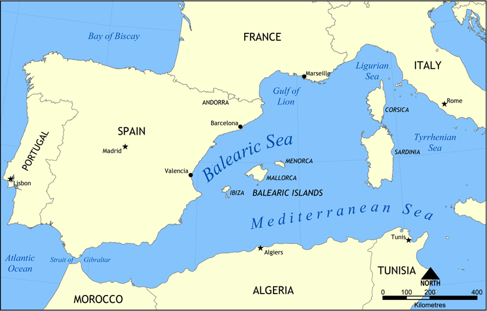
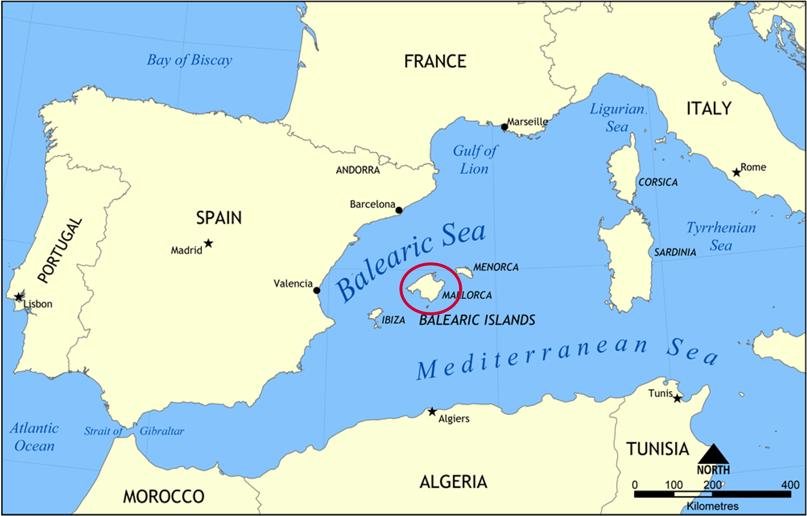
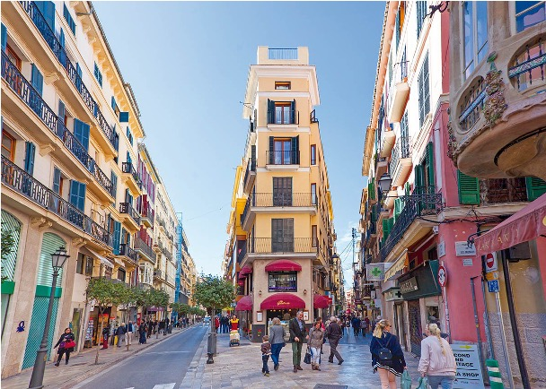
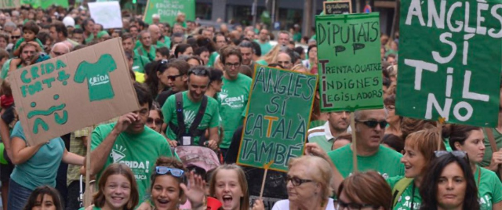
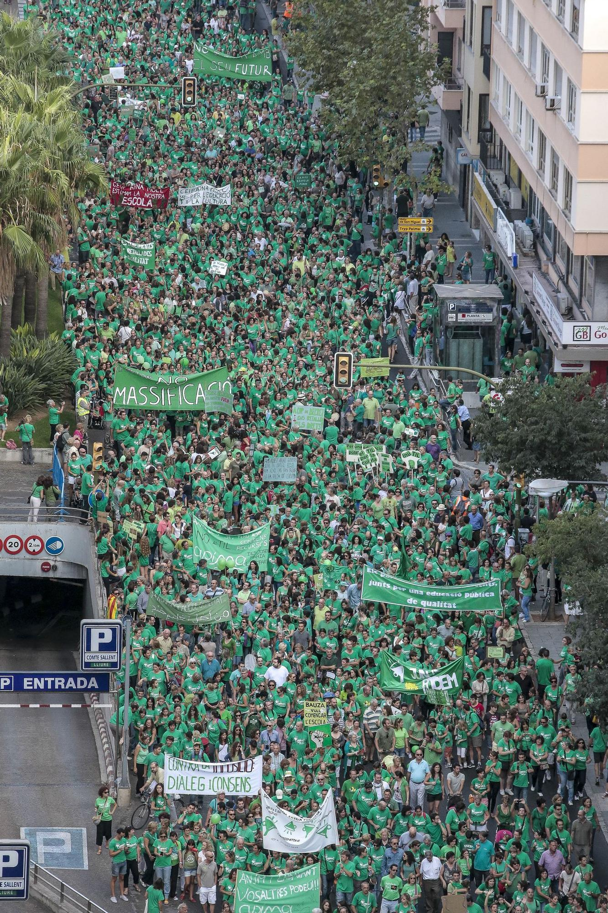
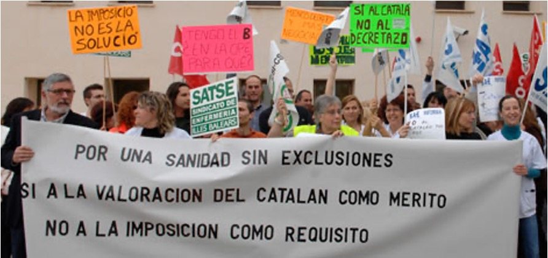

```{r, 'Loaded packages', echo=FALSE, message=FALSE}
library(papaja)
library(tinylabels)
library(tidyverse)
library(untidydata)
library(here)
library(car)
library(broom)
library(emmeans)
library(lme4)
library(dplyr)
library(kableExtra)
library(gt)
library(readxl)
options(scipen = 99)
options(digits = 4)

```

# A little bit of context...

<div style="text-align:center;">
    
</div>

---

# A little bit of context...

<div style="text-align:center;">
    
</div>

---
# Palma

* Capital city of the Balearic Islands.

* Biggest city in Mallorca.

* 1.2 M inhabitants (INE, 2024):

  + 80% live in Mallorca.

    + 40% live in Palma.
    
* A "melting pot" (Blas-Arroyo, 2007).
    
* Languages: Catalan and Spanish.

<div style="position: absolute; top: 40px; right: 30px;">
    
</div>

<div style="position: absolute; top: 350px; right: 30px;">
    
</div>

---

# Linguistic situation in the Balearic Islands

* Catalan and Spanish have coexisted since the **16th century**.

* There have been attempts from former governments to **reduce** the presence of Catalan (e.g., Franco’s Dictatorship, 1939-1975).

* In the 1970s and 1980s, a legal framework was developed in the Balearic Islands to normalize and promote Catalan.

  + *Spanish Constitution* (1978).
  
  + *Statute of Autonomy of the Balearic Islands* (1983).
  
  + *Linguistic Normalization of the Balearic Islands Act* (1986).

* Since then, the general knowledge of Catalan has **increased** considerably.

* The establishment of this legal framework, and the implementation of certain language policies, seem to have been accompanied by a process of **polarization** in terms of language attitudes.

---

# Language attitudes and language policy

* Policy and planning should be intended to change language attitudes (O'Rourke & Hogan-Brun, 2012).

* Language policy can influence language attitudes (Marley, 2004) **&rarr;** Language attitudes toward Portuguese in Uruguay in the 19th century (Bertolotti & Coll, 2020).
  
* Language attitudes can influence language policy (Errihani, 2008; Mukhuba, 2005) **&rarr;** Language attitudes toward Papiamentu in Curaçao (Kester, 2020)
  
* This relationship has also been explored in regions where Catalan and Spanish coexist from many different perspectives (mainly Catalonia):

  + **Education** (Huguet, 2001; Huguet & Suïls, 1997; Janés et al., 2008).

  + **Immigration and ethnic origin** (Estors Sastre, 2014; Iglesias, 2010).
 
  + **Age** (Joan i Marí, 2010; Ubalde, 2013).
  
  + **Family** (Huguet, 2005)
  
---

# What about the Balearic Islands?
  
* **Place of residence** (Calafat-Vila & Calero-Pons, 2019).

* **Mother tongue** (Aguiló-Mora & Lynch, 2017; Calafat-Vila & Calero-Pons, 2019; Ibáñez-Ferreté, 2014; Tudela Isanta, 2021).

* **Age** (Aguiló-Mora & Lynch, 2017; Castell et al., 2023).

* **Identity** (Calafat-Vila & Calero-Pons, 2019; Ibáñez-Ferreté, 2014; Tudela Isanta, 2021).

* **Political orientation** (Aguiló-Mora & Lynch, 2017; Castell et al., 2023; Ibáñez-Ferreté, 2014).

  + Especially in recent years **&rarr;** **Ongoing political debate** (Amorós, 2017; Colmenero, 2018; Colom, 2023; Crespí, 2023; Galvín, 2017; Garau, 2023; Gentili, 2013; Manresa, 2015; Mateos, 2023; Olaizola, 2013; Pellicer, 2023; Sánchez, 2023).

---

# Political orientation and language attitudes

* In favor of Catalan...

<div style="position: absolute; top: 250px; left: 32px;">
    
</div>

<div style="position: absolute; top: 140px; right: 30px;">
    
</div>

---

# Political orientation and language attitudes

* In favor of Spanish

<div style="position: absolute; top: 190px; center: 0;">
    
</div>

<div style="position: absolute; top: 400px; right: 40px;">
    
</div>

---

# The present study

* **GOAL**: to further explore the relationship between language attitudes and political orientation in Palma.

* **PURPOSE**: to examine whether political orientation is a significant predictor of the language attitudes of Palma’s population toward Catalan and Spanish.

* Why Palma?

  + It concentrates 40% of the archipelago’s population (INE, 2024)

  + It is the most diverse city – “melting pot” (Blas-Arroyo, 2007)

  + Lower social contact with Catalan (Calafat Vila & Calero-Pons (2019)

---

# Research Questions

<br>

  **RQ1**: Is political orientation a significant predictor of the language attitudes toward Catalan and Spanish in Palma?

<br>

<br>

  **RQ2**: What is the relationship between different political orientations and language attitudes of the population of Palma toward Catalan and Spanish?

---

# Method

*Materials*

* Online survey hosted on Qualtrics. Three parts:

  + **First**: Demographic questionnaire (gender, age, ethnic origin, SES, and political orientation).
  
  + **Second**: Language use questionnaire (knowledge of Catalan and Spanish, mother tongue, other languages studied, and language used with different social groups and in different social contexts.
  
  + **Third**: Language attitudes questionnaire. Two types of questions:
  
      + Incomplete sentences (e.g., "the official language of the Balearic Islands should be...").
    
      + 60 evaluative statements (e.g., "I like it when people use Spanish") **&rarr;** followed by a 100-point draggable sliding scale.
      
          + Related to specific topics and ongoing discourses surrounding Catalan and Spanish in the Balearic context.

---

# Method

*Procedure*

* Participants self-identified for this study. Requirements:

  + To be over 18 years old.

  + To live in Palma or to have lived in Palma for 5 years.

  + To have knowledge of Catalan and Spanish.

+ Survey shared using social networks and other communication channels.

* Participants completed the survey on their own electronic devices, at their own pace, and without being observed.

* It took 15 minutes.

* Participants were paid 10€

---

# Method

*Participants*

* 127 responses were collected (28 were discarded). TOTAL: 99.

* Data collection took place during a ten-day period during the Fall 2023 semester.

```{r, echo=FALSE, message=FALSE, fig.align='center'}

qp_data_raw_1 <- read_excel("~/Library/Mobile Documents/com~apple~CloudDocs/rutgers/phd/second_year/QP/paper/RESULTS/qp_data_raw_1.xlsx")

qp_data <- qp_data_raw_1[-(100:126),]

qp_data$age <- as.numeric(qp_data$age)

qp_data$political_orientation <- factor(qp_data$political_orientation, levels = c("Far left", "Left", "Center-Left", "Centre", "Center-Right", "Right"))

gender_summary <- qp_data %>%
  group_by(gender) %>%
  summarise(
    total_count = n(),
    avg_age = mean(age, na.rm = TRUE),
    sd_age = sd(age, na.rm = TRUE)
  ) %>%
  bind_rows(qp_data %>%
              summarise(
                gender = "Total",
                total_count = n(),
                avg_age = mean(age, na.rm = TRUE),
                sd_age = sd(age, na.rm = TRUE)
              )) %>%
  rename(
   'Gender' = gender,
    'Total Count' = total_count,
    'Average Age' = avg_age,
    'SD' = sd_age
  )


knitr::kable(gender_summary, align = "c") %>%
  kableExtra::kable_styling(latex_options = c("scale_down", "repeat_header", "striped", "hold_position", "font_size"))


```

---

# Method

*Participants*

  * Proficiency in Catalan and Spanish
  
```{r, echo=FALSE, message=FALSE, fig.align='center', fig.width=15, fig.height=8.5}
qp_data |> 
  select(catalan_proficiency_understand:spanish_proficiency_write) |>
  pivot_longer(
    col = catalan_proficiency_understand:spanish_proficiency_write, 
    names_to = "Skills", 
    values_to = "avg"
  ) |>
  separate(Skills, into = c("language", "Skills"), sep = 7) |>
  mutate(Skills = stringr::str_remove(Skills, "\\_proficiency\\_")) |>
  mutate(language = case_when(
    language == "catalan" ~ "Catalan",
    language == "spanish" ~ "Spanish",
    TRUE ~ "Prop"
  )) |>
  group_by(language, Skills) |>
  count(avg) |>
  mutate(prop = n / 99) |>
  ggplot() +
  aes(x = Skills, y = prop, fill = language) +
  geom_bar(stat = "identity", position = "dodge")
```
---

# Method

*Participants*

  * Political orientation

```{r, echo=FALSE, message=FALSE, fig.align='center', fig.width=15, fig.height=8.5}
ggplot(
  data = qp_data, 
  aes(
    x = political_orientation, 
    fill = political_orientation)) + 
  geom_bar() +
  scale_x_discrete(labels = c("Far left" = "Far-Left")) +
  scale_fill_manual(
    values = c("indianred2", "indianred2", "indianred2", "cornflowerblue", "cornflowerblue", "cornflowerblue"),
    name = "Political orientation") +  # Set the legend title
  labs(y = "Count", x = "Political orientation")
```
---

# Method

*Participants*

  * Mother tongue as a function of political orientation

```{r, echo=FALSE, message=FALSE, fig.align='center', fig.width=15, fig.height=8.5}
qp_data$mother_tongue <- factor(qp_data$mother_tongue, levels = c("Catalan", "Both", "Spanish", "Other(s)"))

qp_data %>%
  filter(mother_tongue != "Other(s)") %>%
  ggplot(aes(x = political_orientation, fill = mother_tongue)) +
  geom_bar(stat = "count", position = "fill") +
  labs(y = "Count", fill = "Mother tongue", x = "Political orientation")
``` 
  
---

# Method

*Data analysis*

  * R Core Team.
  
  * Hierarchically nested linear regression models (one for each evaluative statement):
  
    + lme4 package (Bates et al., 2015).
    
  * Nested model comparisons:
  
    + anova() function (Fox & Weisberg, 2019).
    
---
    
# Results

* Significant association of **political orientation** and **language attitudes**.

* A total of **39/60** statements were significant (the vast majority of them related to **Catalan**).

* Categories:

  + Language preference
  
  + Language difficulty and enjoyment 
  
  + Language importance and usefulness

  + Language policy and integration

  + Cultural and identity aspects

  + Popular trends
  
---

# Results

* Language preference

```{r, echo=FALSE, message=FALSE, fig.align='center', fig.width=9, fig.height=6}
ggplot(
  data = qp_data, 
  aes(
    x = political_orientation,
    y = I_try_to_use_Catalan_whenever_I_can, 
    fill = political_orientation)) + 
  geom_point(size = 1) +  # Set the size of the points on the plot
  stat_summary(fun.data = mean_se, geom = "pointrange", pch = 23, size = 2) +
  labs(x = "Political orientation", y = "I try to use Catalan whenever I can", fill = "Political Orientation") +
  scale_fill_manual(values = c("indianred2", "indianred2", "indianred2", "cornflowerblue", "cornflowerblue", "cornflowerblue")) +
  theme(
    legend.key.size = unit(1, "lines"),  # Set the size of the legend key
    legend.key.width = unit(1.5, "lines"),  # Set the width of the legend key
    legend.spacing.x = unit(0.5, "lines")  # Adjust spacing between legend items
  ) +
  guides(fill = guide_legend(override.aes = list(size = 0.5)))  # Set the size of points in the legend
```
---

# Results

* Language preference

```{r, echo=FALSE, message=FALSE, fig.align='center', fig.width=9, fig.height=6}
ggplot(
  data = qp_data, 
  aes(
    x = political_orientation,
    y = I_try_to_use_Spanish_whenever_I_can, 
    fill = political_orientation)) + 
  geom_point(size = 1) +  # Set the size of the points on the plot
  stat_summary(fun.data = mean_se, geom = "pointrange", pch = 23, size = 2) +
  labs(x = "Political orientation", y = "I try to use Spanish whenever I can", fill = "Political Orientation") +
  scale_fill_manual(values = c("indianred2", "indianred2", "indianred2", "cornflowerblue", "cornflowerblue", "cornflowerblue")) +
  theme(
    legend.key.size = unit(1, "lines"),  # Set the size of the legend key
    legend.key.width = unit(1.5, "lines"),  # Set the width of the legend key
    legend.spacing.x = unit(0.5, "lines")  # Adjust spacing between legend items
  ) +
  guides(fill = guide_legend(override.aes = list(size = 0.5)))  # Set the size of points in the legend

```

---

# Results

* Language difficulty and enjoyment

```{r, echo=FALSE, message=FALSE, fig.align='center', fig.width=9, fig.height=6}
ggplot(
  data = qp_data, 
  aes(
    x = political_orientation,
    y = An_outsider_will_find_it_less_difficult_to_learn_Spanish_than_Catalan, 
    fill = political_orientation)) + 
  geom_point(size = 1) +  # Set the size of the points on the plot
  stat_summary(fun.data = mean_se, geom = "pointrange", pch = 23, size = 2) +
  labs(x = "Political orientation", y = "An outsider will find it less difficult to learn Spanish", fill = "Political Orientation") +
  scale_fill_manual(values = c("indianred2", "indianred2", "indianred2", "cornflowerblue", "cornflowerblue", "cornflowerblue")) +
  theme(
    legend.key.size = unit(1, "lines"),  # Set the size of the legend key
    legend.key.width = unit(1.5, "lines"),  # Set the width of the legend key
    legend.spacing.x = unit(0.5, "lines")  # Adjust spacing between legend items
  ) +
  guides(fill = guide_legend(override.aes = list(size = 0.5)))  # Set the size of points in the legend
```

---

# Results

* Language difficulty and enjoyment

```{r, echo=FALSE, message=FALSE, fig.align='center', fig.width=9, fig.height=6}
ggplot(
  data = qp_data, 
  aes(
    x = political_orientation,
    y = Catalan_is_a_beautiful_language, 
    fill = political_orientation)) + 
  geom_point(size = 1) +  # Set the size of the points on the plot
  stat_summary(fun.data = mean_se, geom = "pointrange", pch = 23, size = 2) +
  labs(x = "Political orientation", y = "Catalan is a beautiful language", fill = "Political Orientation") +
  scale_fill_manual(values = c("indianred2", "indianred2", "indianred2", "cornflowerblue", "cornflowerblue", "cornflowerblue")) +
  theme(
    legend.key.size = unit(1, "lines"),  # Set the size of the legend key
    legend.key.width = unit(1.5, "lines"),  # Set the width of the legend key
    legend.spacing.x = unit(0.5, "lines")  # Adjust spacing between legend items
  ) +
  guides(fill = guide_legend(override.aes = list(size = 0.5)))  # Set the size of points in the legend
```

---

# Results

* Language importance and usefulness

```{r, echo=FALSE, message=FALSE, fig.align='center', fig.width=9, fig.height=6}
ggplot(
  data = qp_data, 
  aes(
    x = political_orientation,
    y = Catalan_is_as_important_as_English, 
    fill = political_orientation)) + 
  geom_point(size = 1) +  # Set the size of the points on the plot
  stat_summary(fun.data = mean_se, geom = "pointrange", pch = 23, size = 2) +
  labs(x = "Political orientation", y = "Catalan is as important as English", fill = "Political Orientation") +
  scale_fill_manual(values = c("indianred2", "indianred2", "indianred2", "cornflowerblue", "cornflowerblue", "cornflowerblue")) +
  theme(
    legend.key.size = unit(1, "lines"),  # Set the size of the legend key
    legend.key.width = unit(1.5, "lines"),  # Set the width of the legend key
    legend.spacing.x = unit(0.5, "lines")  # Adjust spacing between legend items
  ) +
  guides(fill = guide_legend(override.aes = list(size = 0.5)))  # Set the size of points in the legend
```

---

# Results

* Language importance and usefulness

```{r, echo=FALSE, message=FALSE, fig.align='center', fig.width=9, fig.height=6}
ggplot(
  data = qp_data, 
  aes(
    x = political_orientation,
    y = Spanish_is_as_important_as_English, 
    fill = political_orientation)) + 
  geom_point(size = 1) +  # Set the size of the points on the plot
  stat_summary(fun.data = mean_se, geom = "pointrange", pch = 23, size = 2) +
  labs(x = "Political orientation", y = "Spanish is as important as English", fill = "Political Orientation") +
  scale_fill_manual(values = c("indianred2", "indianred2", "indianred2", "cornflowerblue", "cornflowerblue", "cornflowerblue")) +
  theme(
    legend.key.size = unit(1, "lines"),  # Set the size of the legend key
    legend.key.width = unit(1.5, "lines"),  # Set the width of the legend key
    legend.spacing.x = unit(0.5, "lines")  # Adjust spacing between legend items
  ) +
  guides(fill = guide_legend(override.aes = list(size = 0.5)))  # Set the size of points in the legend
```

---

# Results

* Language policy and integration

```{r, echo=FALSE, message=FALSE, fig.align='center', fig.width=9, fig.height=6}
ggplot(
  data = qp_data, 
  aes(
    x = political_orientation,
    y = It_should_be_mandatory_for_all_students_from_the_Balearic_Islands_to_take_at_least_50_of_their_subjects_in_Spanish, 
    fill = political_orientation)) + 
  geom_point(size = 1) +  # Set the size of the points on the plot
  stat_summary(fun.data = mean_se, geom = "pointrange", pch = 23, size = 2) +
  labs(x = "Political orientation", y = "Mandatory to take 50% of the subjects in Spanish", fill = "Political Orientation") +
  scale_fill_manual(values = c("indianred2", "indianred2", "indianred2", "cornflowerblue", "cornflowerblue", "cornflowerblue")) +
  theme(
    legend.key.size = unit(1, "lines"),  # Set the size of the legend key
    legend.key.width = unit(1.5, "lines"),  # Set the width of the legend key
    legend.spacing.x = unit(0.5, "lines")  # Adjust spacing between legend items
  ) +
  guides(fill = guide_legend(override.aes = list(size = 0.5)))  # Set the size of points in the legend
```

---
# Results

* Language policy and integration

```{r, echo=FALSE, message=FALSE, fig.align='center', fig.width=9, fig.height=6}
ggplot(
  data = qp_data, 
  aes(
    x = political_orientation,
    y = Catalan_must_be_a_requirement_to_hold_a_job_in_the_public_administration, 
    fill = political_orientation)) + 
  geom_point(size = 1) +  # Set the size of the points on the plot
  stat_summary(fun.data = mean_se, geom = "pointrange", pch = 23, size = 2) +
  labs(x = "Political orientation", y = "Requiremen to hold a job in the public administration", fill = "Political Orientation") +
  scale_fill_manual(values = c("indianred2", "indianred2", "indianred2", "cornflowerblue", "cornflowerblue", "cornflowerblue")) +
  theme(
    legend.key.size = unit(1, "lines"),  # Set the size of the legend key
    legend.key.width = unit(1.5, "lines"),  # Set the width of the legend key
    legend.spacing.x = unit(0.5, "lines")  # Adjust spacing between legend items
  ) +
  guides(fill = guide_legend(override.aes = list(size = 0.5)))  # Set the size of points in the legend
```
---

# Results

* Cultural and identity aspects

```{r, echo=FALSE, message=FALSE, fig.align='center', fig.width=9, fig.height=6}
ggplot(
  data = qp_data, 
  aes(
    x = political_orientation,
    y = Catalan_is_the_language_that_should_predominate_in_the_Balearic_Islands, 
    fill = political_orientation)) + 
  geom_point(size = 1) +  # Set the size of the points on the plot
  stat_summary(fun.data = mean_se, geom = "pointrange", pch = 23, size = 2) +
  labs(x = "Political orientation", y = "Catalan should predominate in the Balearic Islands", fill = "Political Orientation") +
  scale_fill_manual(values = c("indianred2", "indianred2", "indianred2", "cornflowerblue", "cornflowerblue", "cornflowerblue")) +
  theme(
    legend.key.size = unit(1, "lines"),  # Set the size of the legend key
    legend.key.width = unit(1.5, "lines"),  # Set the width of the legend key
    legend.spacing.x = unit(0.5, "lines")  # Adjust spacing between legend items
  ) +
  guides(fill = guide_legend(override.aes = list(size = 0.5)))  # Set the size of points in the legend
```

---

# Results

* Cultural and identity aspects

```{r, echo=FALSE, message=FALSE, fig.align='center', fig.width=9, fig.height=6}
ggplot(
  data = qp_data, 
  aes(
    x = political_orientation,
    y = Catalan_is_an_identity_element_of_the_Balearic_Islands, 
    fill = political_orientation)) + 
  geom_point(size = 1) +  # Set the size of the points on the plot
  stat_summary(fun.data = mean_se, geom = "pointrange", pch = 23, size = 2) +
  labs(x = "Political orientation", y = "Catalan is an identity element of the Balearic Islands", fill = "Political Orientation") +
  scale_fill_manual(values = c("indianred2", "indianred2", "indianred2", "cornflowerblue", "cornflowerblue", "cornflowerblue")) +
  theme(
    legend.key.size = unit(1, "lines"),  # Set the size of the legend key
    legend.key.width = unit(1.5, "lines"),  # Set the width of the legend key
    legend.spacing.x = unit(0.5, "lines")  # Adjust spacing between legend items
  ) +
  guides(fill = guide_legend(override.aes = list(size = 0.5)))  # Set the size of points in the legend
```
---

# Results

* Popular trends

```{r, echo=FALSE, message=FALSE, fig.align='center', fig.width=9, fig.height=6}
ggplot(
  data = qp_data, 
  aes(
    x = political_orientation,
    y = Catalan_is_in_danger_of_disappearing_in_the_Balearic_Islands, 
    fill = political_orientation)) + 
  geom_point(size = 1) +  # Set the size of the points on the plot
  stat_summary(fun.data = mean_se, geom = "pointrange", pch = 23, size = 2) +
  labs(x = "Political orientation", y = "Catalan is in danger in the Balearic Islands", fill = "Political Orientation") +
  scale_fill_manual(values = c("indianred2", "indianred2", "indianred2", "cornflowerblue", "cornflowerblue", "cornflowerblue")) +
  theme(
    legend.key.size = unit(1, "lines"),  # Set the size of the legend key
    legend.key.width = unit(1.5, "lines"),  # Set the width of the legend key
    legend.spacing.x = unit(0.5, "lines")  # Adjust spacing between legend items
  ) +
  guides(fill = guide_legend(override.aes = list(size = 0.5)))  # Set the size of points in the legend
```
---

# Results

* Popular trends

```{r, echo=FALSE, message=FALSE, fig.align='center', fig.width=9, fig.height=6}
ggplot(
  data = qp_data, 
  aes(
    x = political_orientation,
    y = People_should_put_more_effort_into_using_Spanish, 
    fill = political_orientation)) + 
  geom_point(size = 1) +  # Set the size of the points on the plot
  stat_summary(fun.data = mean_se, geom = "pointrange", pch = 23, size = 2) +
  labs(x = "Political orientation", y = "People should put more effort into using Spanish", fill = "Political Orientation") +
  scale_fill_manual(values = c("indianred2", "indianred2", "indianred2", "cornflowerblue", "cornflowerblue", "cornflowerblue")) +
  theme(
    legend.key.size = unit(1, "lines"),  # Set the size of the legend key
    legend.key.width = unit(1.5, "lines"),  # Set the width of the legend key
    legend.spacing.x = unit(0.5, "lines")  # Adjust spacing between legend items
  ) +
  guides(fill = guide_legend(override.aes = list(size = 0.5)))  # Set the size of points in the legend
```
---
# Discussion

**RQ1**: Is political orientation a significant predictor of the language attitudes toward Catalan and Spanish in Palma?

  + Yes! This helps us understand:
  
    + The political motivations for current languages policies in the Balearic Islands.
    
    + The views and reactions of the population toward the policies and their implementation.

**RQ2**: What is the relationship between different political orientations and language attitudes of the population of Palma toward Catalan and Spanish?
  
  * There are clear political divisions with regard to language attitudes.
    
  * Differing attitudes towards Catalan and Spanish reflect their social and cultural positions in the community.
    
  * Individuals language attitudes need not always align with usage patterns.
---

# Disussion

* First finding:

  + Clear division between progressive and conservative participants in terms of language attitudes (Ibáñez Ferreté, 2014).
  
      + **Progressive participants**: positive language attitudes toward both Catalan and Spanish (bilingualism), with a stronger preference for Catalan. Possible explanations:
      
          + Mother tongue (Aguiló-Mora & Lynch, 2017; Calafat Vila & Calero-Pons, 2019; Ibáñez Ferreté, 2014; Tudela Isanta, 2021).
        
          + Identity (Ibáñez Ferreté, 2014).
    
      + **Conservative participants**: positive attitudes toward Spanish and comparatively less positive attitudes toward Catalan.
    
  + These findings reflect the current political debate in the Balearic Islands regarding the status and the presence that each language should have both at a societal and political level.
  
---

# Disussion

* Second finding:

  + Results follow the framework of **authentic** versus **anonymous** laid out by Woolard (2001).
  
      + **Authentic**: language or linguistic variety defined as one that is related to an identity, an emotional dimension, and a particular community.
    
      + **Anonymous**: language or linguistic variety not related to a specific identity aspect and is normally the hegemonic one in the public sphere and, therefore, become a **neutral** language.
    
  + In the context of the Balearic Islands:
  
      + Authentic language: **Catalan** (strong language attitudes - identity element).
    
      + Anonymous language: **Spanish** (neutral language attitudes - communication element).

---

# Disussion

* Third finding:

  + Two trends not identified by prior studies:
  
      + **Centrists**: there is a difference in terms of **language attitudes** and **language uses**.
      
          + Possible explanation: Catalan as their L1.
        
              + Need to distinguish more clearly between language attitudes and language uses.
          
      + **Center-left**: neutrality
      
          + As political orientation moves toward the center, language attitudes become more neutral and less extreme, with language attitudes essentially becoming less tied to political orientation. 
        
          + As political orientation becomes more extreme, either to the left or to the right, attitudes toward one’s own languages become more polarized and no longer neutral.

---

# Conclusions

<br>

* There is a significant associations between language policy and language attitudes.

<br>

* Political orientation can be a significant predictor of the language attitudes in a given society **&rarr;** process of polarization.

<br>

* Languages play different roles in society, influenced by people's perceptions of these languages.

---

<div style="position: absolute; top: 200px; font-size:50px; right: 290px;">
    Moltes gràcies!
</div>

<div style="position: absolute; top: 300px; font-size:50px; right: 270px;">
    ¡Muchas gracias!
</div>

<div style="position: absolute; top: 400px; font-size:50px; right: 330px;">
    Thank you!
</div>

---

<div style="position: absolute; top: 300px; font-size:50px; right: 320px;">
    Questions?
</div>
